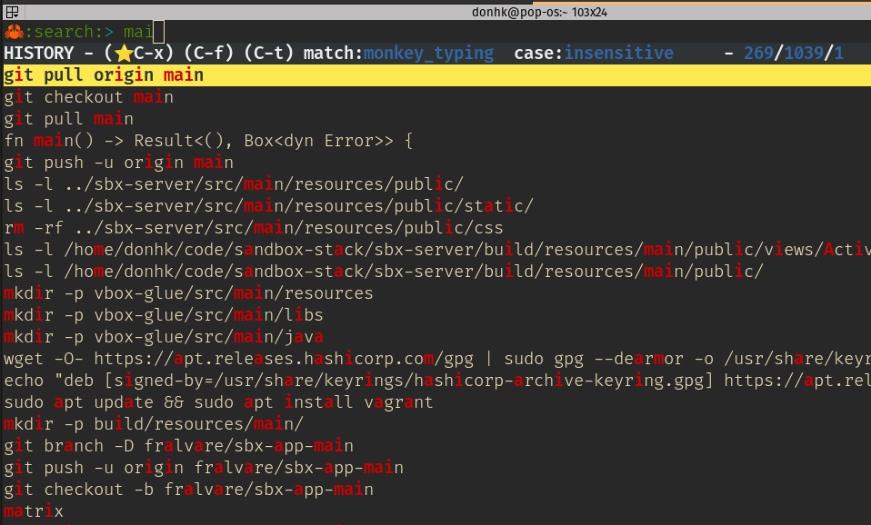

# 🚀 rushstr

**rushstr** is a fast, Rust-powered interactive shell history searcher — a modern, dependency-free alternative to [`hstr`](https://github.com/dvorka/hstr). Search, filter, and reuse your command-line history with fuzzy matching and a responsive TUI.

---

## ✨ Highlights

- ⚡ **Blazing fast** — implemented in pure Rust
- 🔍 **Fuzzy, regex, and exact** matchers
- 🎯 **Keyboard-first interface** — no mouse needed
- 💾 **Persistent command history** with favorites and usage stats
- 🐚 **Zsh support** — seamlessly integrates into your existing shell

---

## 📦 Installation

## Pre-built binaries

### 🔧 MacOS

```zsh
# one time
brew tap donhk/homebrew-tap
# install
brew install donhk/homebrew-tap/rushstr
rushstr --zsh-shell-conf
source ~/.zshrc
# upgrade
brew upgrade donhk/homebrew-tap/rushstr
```

### 🔧 Linux

```zsh
curl -sSL https://raw.githubusercontent.com/donhk/rushstr/main/install.sh | zsh
```

---

### Using `cargo`

```zsh
cargo install rushstr
```

> Requires [Rust](https://www.rust-lang.org/tools/install)

### From source

```zsh
git clone https://github.com/donhk/rushstr.git
cd rushstr
cargo build --release
./target/release/rushstr
```

## 🎮 Keybindings

| Key Combo | Action                          |
|-----------|---------------------------------|
| `Ctrl+X`  | Mark/unmark as favorite         |
| `Ctrl+F`  | Show only favorites             |
| `Ctrl+T`  | Switch between matching modes   |
| `Enter`   | Select and print command        |
| `Ctrl+C`  | Copy selected command to clipboard and exit |

---

## 📸 Screenshot



---

## 🛠 Development

```bash
# Run in debug mode
cargo run

# Run tests
cargo test
```

--- 

## 🛠 Update the version

```zsh
cargo release 1.4.0 --no-push --no-tag --no-publish --execute
cargo patch --no-push --no-tag --no-publish --execute
cargo minor --no-push --no-tag --no-publish --execute
```
